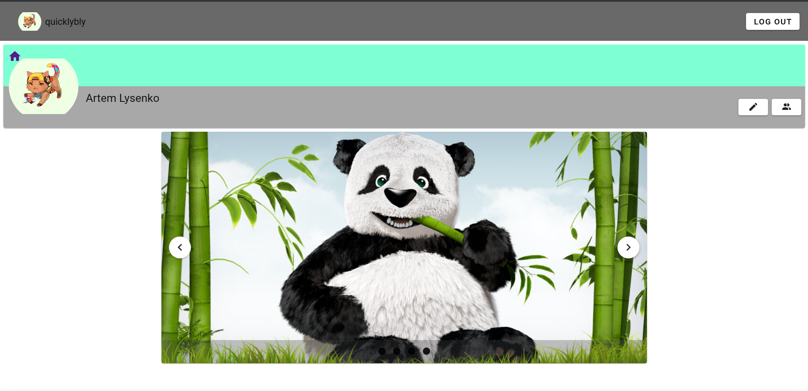

# Kinder

Kinder is a simple social network created with Vue, Spring and PostgreSQL.

## Table of content

* [Features](#features)
* [Screenshots](#screenshots)
* [Technologies Used](#technologies-used)
* [Project status](#project-status)
* [License](#license)
* [Contact](#contact)

## Features

* Cookie based authentication
* Search for friend
* Add friend
* Delete friend
* See user profile page
* Update profile

## Screenshots

## Technologies Used

* Java 19
* Spring boot 2.7.5
* PostgreSQL 14.6
* Vue 3
* Vuetify 3.0.0 as a component library
* Vue-router 4

## Project status

Project is: in progress  
To-do:

* Migrate from Spring-data-jdbc to jpa
* Add comments/likes support
* Integrate chat system

## License

> You can check out the full license [here](https://github.com/quicklybly/kinder/blob/master/LICENSE)

This project is licensed under the terms of the **MIT** license.

## Contact

Created by [@quicklybly](https://t.me/quicklybly) - feel free to contact me!

